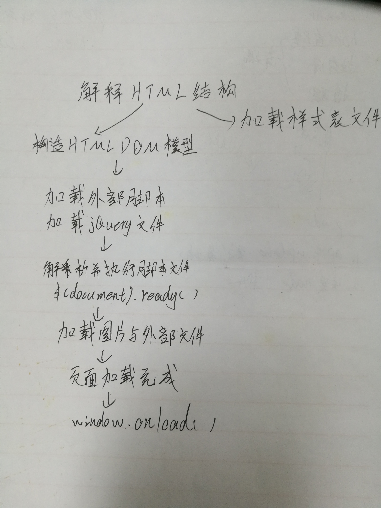

## 第一题
### DOM => jQuery
```
  使用$(DOM)去访问
```
### jQuery => DOM
```
  使用jQuery[0]去访问
```
## 第二题



## 第三题
```
$("div").appendTo("body")
```
## 第四题
```
$("a").attr(href);
```
## 第五题
```
remove()方法删除的DOM节点,会将节点内部的一切都移除,包括绑定的事件以及该元素相关的jQuery数据
detach()与remove()一样可以移除DOM节点,但detach()不会把元素从jQuery对象中删除,因此可以在将来再使用这些元素
```
## 第六题
```
addClass()为每一个匹配的元素添加指定的一个或多个类名
removeClass()移除匹配的元素身上的一个或多个类名
```
## 第七题
